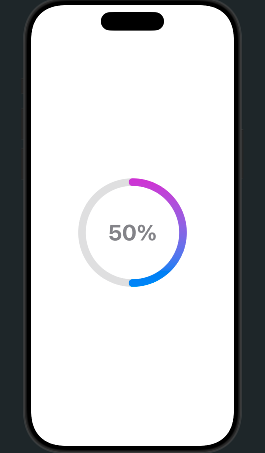

# Progress-Bar

A lightweight and customizable progress bar for iOS written in SwiftUI.

## ✨ Features

* Smooth animations
* Easy to integrate
* Fully customizable

## 📦 Installation

### Swift Package Manager

In Xcode:

* Go to **File → Add Packages**
* Enter:

```
https://github.com/ankush445/Progress-Bar.git
```

Or in `Package.swift`:

```swift
.package(url: "https://github.com/ankush445/Progress-Bar.git", from: "1.0.0")
```

---

## 🚀 Usage

```swift
import ProgressBar
import SwiftUI
struct ContentView: View {
    var body: some View {
        ProgressBar(progress: 0.5, size: 200, lineWidth: 3, style: .gradient)
    }
}
```

## 📸 Preview



---

## 🛠 Requirements

* iOS 13+
* Swift 5+

---

## 📄 License

MIT License
